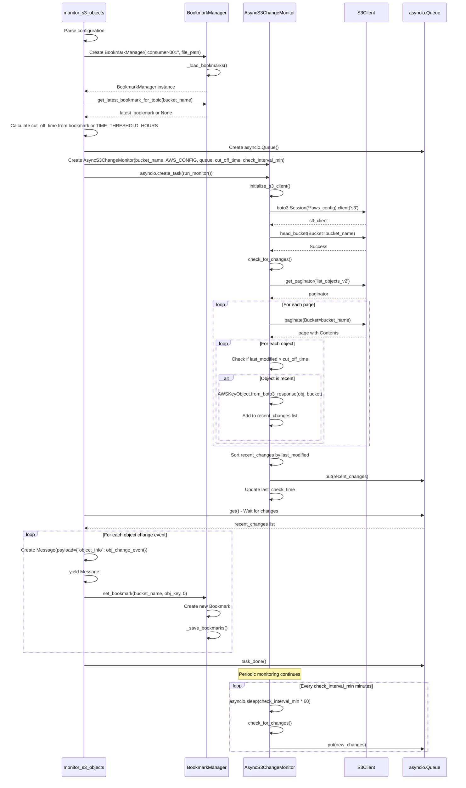

# Redpanda Connect Custom Input Component Example

## Introduction

The example illustrates the process of creating custom input components for Redpanda Connect using the Redpanda Connect plugin framework in Python ([Plugins | Redpanda Connect](https://docs.redpanda.com/redpanda-connect/plugins/about/))

In our Redpanda custom input example, we created a component specifically designed for monitoring AWS S3 buckets. The responsibilities of the S3 monitoring component include:

- Periodically check the S3 buckets for new and updated objects.
- Support bookmarking: ability to start working from a previously checkpointed bookmark

## Custom Plugin Demo

1. Install uv for Python, more details: https://docs.astral.sh/uv/guides/install-python/ 
2. Create and activate a Python virtual environment

    ```bash
    uv venv
    source .venv/bin/activate
    ```

3. Install dependencies

    ```bash
    uv sync
    ```

4. Change the Redpanda Connect pipeline file `connect.yaml`
5. Start the pipeline

    ```bash
    redpanda-connect run --rpc-plugins=./s3_monitor_input.yaml ./connect.yaml
    ```

6. Upload the new file to AWS s3 bucket
7. Check the Rdepanda Connect Console output
The input s3 object monitor component sends the event to the output component, as example:

    ```json
    {
        "object_info": {
            "bucket": "my-data-bucket",
            "cache_control": null,
            "content_disposition": null,
            "content_encoding": null,
            "content_type": null,
            "etag": "ad63c572942f03e8ca8df687fee8ec50",
            "expires": null,
            "is_encrypted": false,
            "key": "data.txt",
            "kms_key_id": null,
            "last_modified": "2025-07-08T13:31:28+00:00",
            "metadata": {},
            "owner_display_name": null,
            "owner_id": null,
            "s3_uri": "s3://my-data-bucket/data.txt",
            "server_side_encryption": null,
            "size": 78,
            "size_gb": 7.264316082000732e-8,
            "size_mb": 0.0000743865966796875,
            "storage_class": "STANDARD",
            "version_id": null
        }
    }
    ```

8. Stop the Redpanda Connect pipeline

9. Check the bookmark file: `bookmarks.json`

10. Start the pipeline again when the bookmark file exists. No new events in the output.

    ```bash
    redpanda-connect run --rpc-plugins=./s3_monitor_input.yaml ./connect.yaml
    ```

11. Stop the Redpanda Connect pipeline.

12. Delete bookmark file:

    ```bash
    rm bookmarks.json
    ```

13. Start the pipeline again. We have to see the events again after the bookmark file is deleted.

14. Stop the Redpanda Connect pipeline

## s3 Object Monitor Architecture

### Core classes

- `Bookmark`: Represents a single bookmark.
- `BookmarkManage`: Manages bookmarks
- `AWSKeyObject`: Represents the AWS S3 object 
- `AsyncS3ChangeMonitor`: The main class monitors the S3 object changes and stores/loads bookmarks

